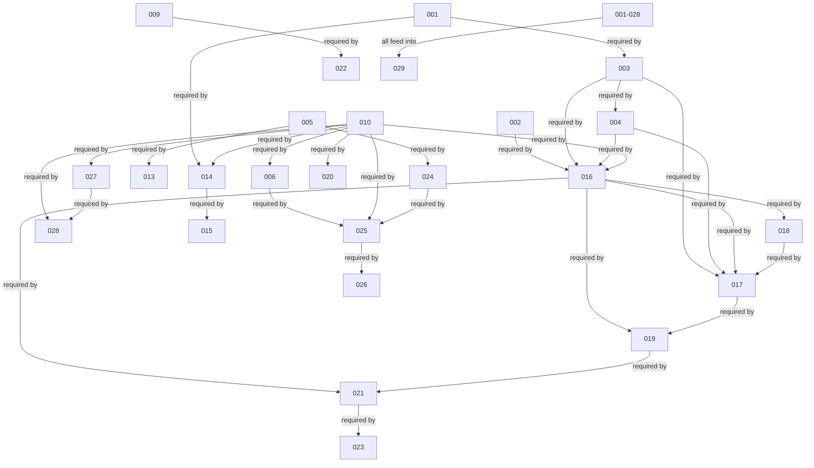

# ADR Dependency Graph

Generated from ADR frontmatter `dependsOn` fields. Shows relationships between all 29 Architecture Decision Records.

## Legend

- **001–004**: Foundation (Document Model, Variables, Expressions)
- **005–006**: Plugin & AI Contracts
- **007–009**: Event, Publish, Asset (Proposed)
- **010–013**: History, Engine Rules, Perf Budget, Security (Core)
- **014–015**: Canvas Engine
- **016–020**: Resolution Pipeline → Property → Theme → Responsive → Timeline
- **021–024**: Publish → Render Tree → Plugin Runtime
- **025–026**: AI Runtime → Agent Contract
- **027–028**: Collaboration → Sync
- **029**: Production Hardening (depends on all)

## Implementation status

- ✅ Accepted & Implemented: 001, 002, 005, 006, 010, 011, 014, 016, 017, 018, 019, 020, 021, 022, 023, 024, 025, 026, 027, 028, 029
- ❓ Proposed: 003, 004, 007, 008, 009, 012, 013, 015
